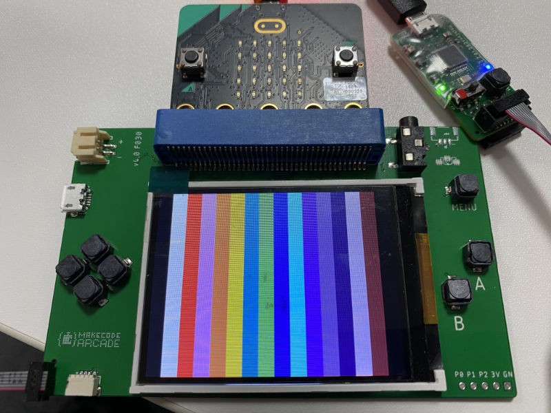
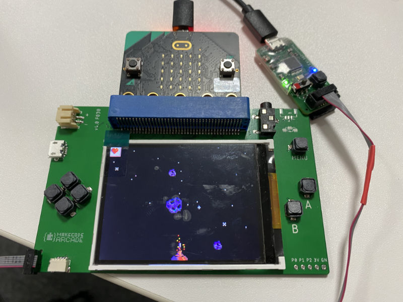

# MakeCode Arcade smart shield firmware

Firmware for shields with screen/buttons that enable MakeCode Arcade.
The shield drives the screen (in particular it can bit-bang a 320x240 parallel
connection screen).

This firmware is just an example. Shield manufactures can use it a base for their own development.

More information on Arcade shield can be found at: 
https://github.com/microsoft/pxt-arcade-hardware-designs/tree/master/microbit-shield#smart-shield

## Building

You will need a Unix-like environment to build the firmware.
On Windows, you can use Windows Subsystem for Linux or mingw32.

* install `arm-none-eabi-gcc` (we've been using `9-2019-q4-major`)
* install `openocd` (optional when using Black Magic Probe)
* install GNU Make
* run `make`; you should get a successful build

Upon first run of `make`, a `Makefile.user` file will be created.
You will want to adjust the settings in there - there are comments in there that should guide you through the process.

To deploy the firmware to a module you will need a debugger interface.
You have three options:
* [Black Magic Probe](https://github.com/blacksphere/blackmagic/wiki);
  you can also re-program other debuggers with BMP firmware
* a CMSIS-DAP debugger; we've been using 
  [Particle Debugger](https://store.particle.io/products/particle-debugger);
  make sure to disconnect micro:bit from your computer when using this
* an ST-LINK/V2 or one of its clones - this is the default setting
You will want to set the right interface in `Makefile.user`.

## First deployment

Head to `main.c`, uncomment call to `show_test_screen()`.
Now deploy your program by running `make run` (or `make r` for short).
You'll likely need to have micro:bit connected to close the power circuit.
You should see vertical stripes on the screen.

If you don't:
* make sure the screen is hardware-configured as 8-bit parallel (and not 16-bit or SPI)
* make sure the screen is using pins `D[17:10]` for communication (`IM3-0` are `1001`);
  see Section 4. of ILI9341 datasheet
* make sure it's an ILI9341 screen; if not you may need to edit `ili9341.c` file

Once you have the screen running, comment out `show_test_screen()` and deploy again.
You now should be able to run Arcade games on the micro:bit.

### Notable make targets

Other than the building/deployment targets, the following might be of note:

* `make gdb` - run GDB debugger
* `make clean` - clean (duh!)

## Contributing

This project welcomes contributions and suggestions.  Most contributions require you to agree to a
Contributor License Agreement (CLA) declaring that you have the right to, and actually do, grant us
the rights to use your contribution. For details, visit https://cla.opensource.microsoft.com.

When you submit a pull request, a CLA bot will automatically determine whether you need to provide
a CLA and decorate the PR appropriately (e.g., status check, comment). Simply follow the instructions
provided by the bot. You will only need to do this once across all repos using our CLA.

This project has adopted the [Microsoft Open Source Code of Conduct](https://opensource.microsoft.com/codeofconduct/).
For more information see the [Code of Conduct FAQ](https://opensource.microsoft.com/codeofconduct/faq/) or
contact [opencode@microsoft.com](mailto:opencode@microsoft.com) with any additional questions or comments.
